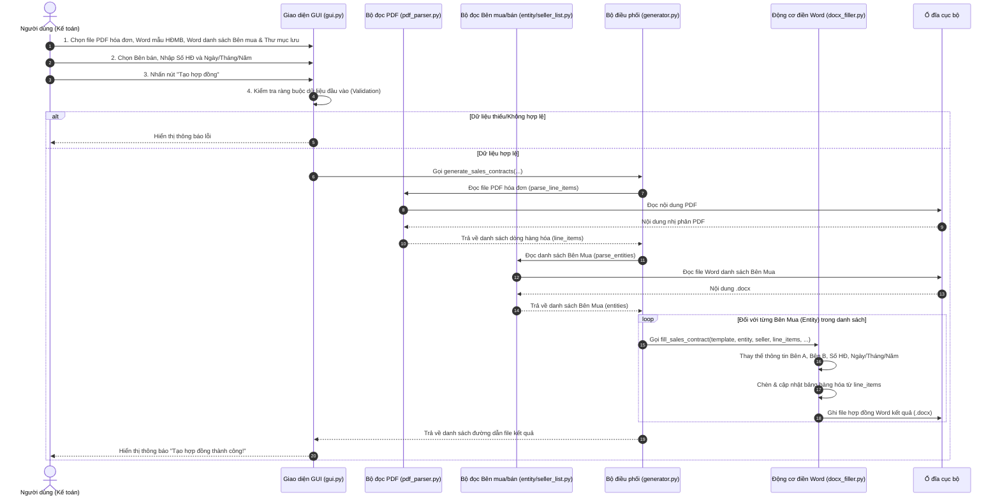
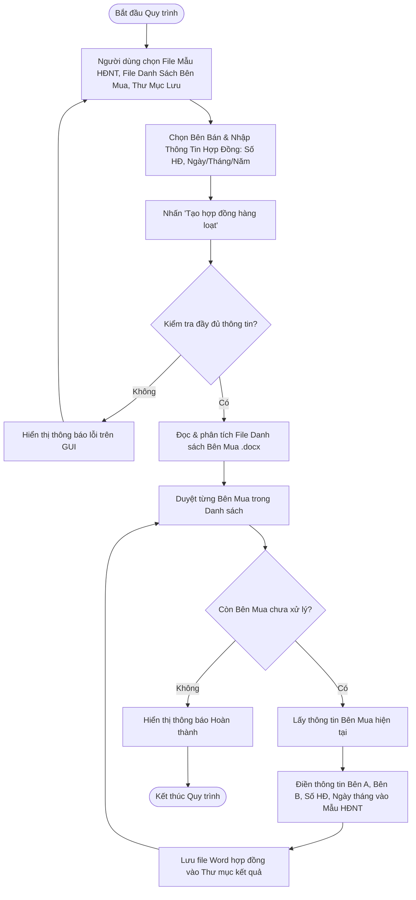
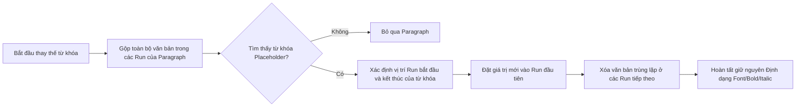

# Tài Liệu Quy Trình Nghiệp Vụ BPMN (Business Process Model and Notation)

## 1. Giới Thiệu
Tài liệu này mô tả chi tiết các quy trình nghiệp vụ của ứng dụng **Tự động Điền và Sinh Hợp đồng** dưới dạng biểu đồ sơ đồ dòng dữ liệu và BPMN chuẩn hóa.

---

## 2. Quy Trình 1: Sinh Hợp Đồng Mua Bán Từ Hóa Đơn PDF (BPMN Diagram)

Quy trình này mô tả sự tương tác giữa Người dùng (Kế toán), Giao diện GUI, Bộ phân tích PDF, Bộ phân tích Word và Động cơ sinh Hợp đồng Mua bán.

---

## 3. Quy Trình 2: Sinh Hợp Đồng Nguyên Tắc Hàng Loạt (BPMN Flowchart)

Biểu đồ dưới đây thể hiện luồng xử lý quyết định khi sinh Hợp đồng Nguyên tắc cho danh sách công ty/hộ kinh doanh.

---

## 4. Quy Trình 3: Xử Lý Điền Văn Bản Trong Paragraph & Table (Word Engine Detail)

Mô tả thuật toán thay thế văn bản giữ nguyên định dạng (Run-preserving text replacement) khi điền hợp đồng.

